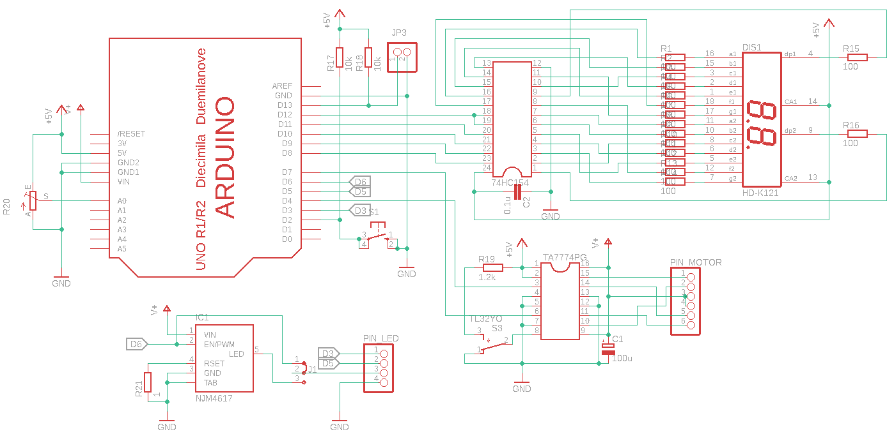
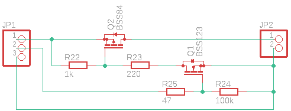
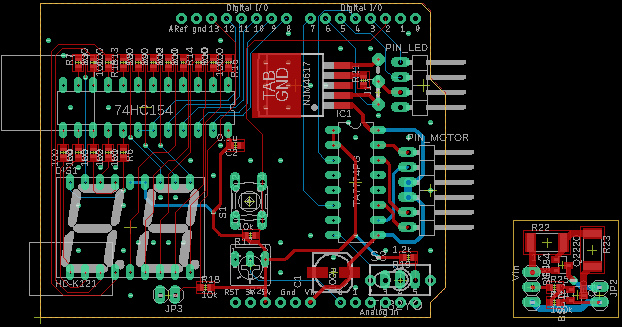
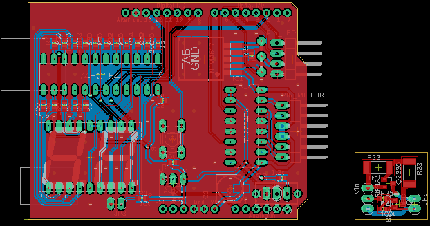

# 回路について
## 概要
アニメ銃に組み込むArduino用シールドです。[Circuit](../Circuit)内にデータを保管してます。
## 回路図
- 本体用シールド

- パワーLED用ハイサイドスイッチ

## 基板パターン(未使用)
- 基板配線

- ベタパターンあり

## ファイル内容
- [回路図(Eagle)](../Circuit/AnimeGun_v1.sch)
- [パターン図(Eagle)](../Circuit/AnimeGun_v1.brd)
- [部品一覧](../Circuit/AnimeGun_bom_v1.txt)
## 使い方
1. Eagleでプロジェクトを新規作成
2. Eagleプロジェクトに上記ファイル2種類を読み込ませます
3. 必要に応じて、ライブラリをインストールしてください(Arduino、7セグLEDなど)
4. LEDドライバの部品のみ、既存ライブラリ(on-semiconductor.lbrのCAT4101)をもとに自作しました。CAT4101をコピーしてピン1と2を入れ替えるだけです。
## 注意点
- Eagleファイルは、試作した回路をもとに**後から作成した**ものです。試作品とは一部実装が異なる部分があります。
- PCBは、ユニバーサル基板で手付けした回路を元にEagleで書き起こしたもので、筐体との寸法や動作が合わない可能性があります
- J1はLEDドライバの実装を切り替えます
  - パワーLED用ドライバを実装する場合は、ピン2と3をショート
  - ドライバを実装しない/外部で接続する場合は、ピン1と2をショート
- LEDドライバの電流は、R21の抵抗値(=0.2/LED電流(A))で設定します。
- パワーLED用ハイサイドスイッチは、試作品で使用したLEDドライバへの電源制御用回路です(試作時は、秋月電子のLEDドライバ(3W)と出力ピン(D6)の間に接続)
  - シールドにLEDドライバを実装する場合は不要です
  - PWMで出力電圧を調整します
  - 電源は、ACアダプタの出力プラグを分岐するなどで接続してください
- Eagleで利用したタクトスイッチ(S1)では筐体に入らない可能性があります。秋月電子のボタン付タクトスイッチ(緑色)を実装してください
- 可変抵抗(R20)は、配線をのばして可変抵抗用の穴にさして固定します
- PIN_LEDはフルカラーLED用にPWMピン3つ(D3,5,6)をつないでいますが、通常は下から2番目のピンD6だけを使います