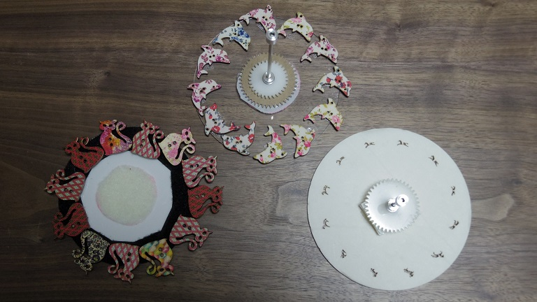

# アニメ用の円板について

## 概要
- サイズは直径12㎝
  - LEDの中心~モーター軸間の距離が 5cm のため
  - 筐体の変更などでLEDとモーターの距離が変われば、適切なサイズも変わります
- 素材は特に決まっていません
  - ただし、以下の条件を満たすものをお勧めします。
    - 自分で簡単に加工できる
    - 重すぎない
    - 立てたときに、曲がったりしなったりしない
  - なお制作時は、スチレンボードとアクリル板をそれぞれレーザーカッターで切り出しました。
## 準備
1. 直径12cmの円板を用意
2. アニメーションのパターン作成
   - パラパラ漫画の要領で、コマ数と絵のパターンを作ります
     - 12コマ位でパターンを用意するといい感じに配置できます
   - 「フェナキストスコープ」や「ゾートロープ」で画像検索するのもおすすめです
3. 円板にパターンを加工
   1. 光の像
      - 円板に等間隔でパターンの穴をくりぬきます
      - レーザーカッターなら円板自体も含めて綺麗に切り出せます。その場合、Adobeイラストレータなどでアニメのコマを円盤に配置したデータを作り、epsファイルを書き出す必要があります
      - 手作業の場合は、厚紙やスチレンボードなどをカッターで切るのが簡単かと思います
   2. 影絵
      - 各コマを切り取ったパーツを串につけ、モーター軸を中心に等間隔で並べると影絵ができます
      - アクリルなど透明な板に、小さなパーツを両面テープを使って貼り付ける方法もあります(画像中央の円板が該当)
4. シャフトと取り付け器具(カップリング)の設置
      - モーター軸は3mmなので、円板に取り付けるシャフトも3㎜幅がおすすめ
      - 円板の中心に、シャフトと同じ直径の穴をあけておきます
      - 円板にシャフトを差して固定します
      - シャフトの反対側に、モーターと結合するための部品をつけます
      - ジョイント用の部品は、[ストッパー](https://www.sengoku.co.jp/mod/sgk_cart/detail.php?code=4AJD-B5EA)や[インラインカラー](https://www.sengoku.co.jp/mod/sgk_cart/detail.php?code=5ALD-CJE7#)を使うといいでしょう
5. モーターとシャフトのジョイント
