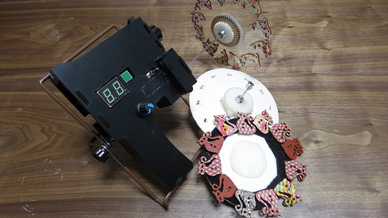
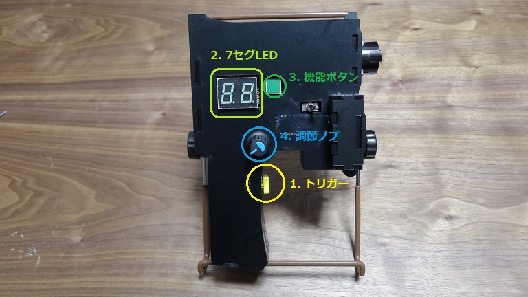

# アニメ銃 (ストロボスコープ式映写機)

## 目次
- [アニメ銃 (ストロボスコープ式映写機)](#アニメ銃-ストロボスコープ式映写機)
  - [目次](#目次)
- [概要](#概要)
- [準備するもの](#準備するもの)
  - [本体](#本体)
  - [円板](#円板)
- [使い方](#使い方)
  - [ボタン一覧](#ボタン一覧)
  - [基本](#基本)
  - [詳細](#詳細)
    - [パラメータ設定](#パラメータ設定)
    - [設定モード](#設定モード)
    - [設定方法](#設定方法)
    - [ファームウェア書き換え](#ファームウェア書き換え)
- [免責事項](#免責事項)
- [開発者](#開発者)
# 概要
影絵でアニメーション映像を見せる映写機です。

電源を入れて、壁に向かって引き金のボタンを押すことで、壁にアニメーションが映し出されます。

アニメのコマを描いた円板をモーターで回し、LEDのストロボ発光でアニメーションを移す仕組みです。
# 準備するもの
## 本体
- Arduino UNO R3
- LED
  - 単色を想定(主に白色)
  - パワーLED(5V, 1W or 3W)にも対応
- 専用シールド
  - [回路およびプリント基板(Eagle用)](./Circuit)
  - 回路の詳細については、[回路についてのドキュメント](./Docs/Document_Circuit.md)を参照
- 筐体
  - アクリル板(厚さ3mm)をレーザーカッターで切断して、各パーツを積み重ねて制作
  - 筐体用のフレームは[Frameフォルダ](./Frame)を参照
  - 詳細は、[筐体についてのドキュメント](./Docs/Document_Frame.md)を参照
  - **試作段階のため、回路が筐体に収まらないなどの問題が生じる可能性があります**
- ACアダプタ(出力：DC12V, 1A以上)
## 円板
詳細は[円板についてのドキュメント](./Docs/Document_Plate.md)を参照。
# 使い方

## ボタン一覧
1. **トリガー**：押すことでアニメを動かします(ストロボ発光+モーター駆動)
2. 7セグLED：設定モード([後述](#設定モード))やアニメに関するパラメータを表示
3. 機能ボタン：押すと設定モードを変更
4. **調節ノブ**：回すことでパラメータを調節

また、トグルスイッチでモーター回転の有効/無効を切り替えられます(右に倒すと有効)。ファームウェアの書き換え中など、モーターを回したくない時は左に倒してください。
## 基本
1. モーターにアニメ用の円板を付けます
2. 本体後ろのDCジャックに、上記のACアダプタから電源を供給
3. 銃口を壁に向けてトリガーを引くと、アニメーションが流れます
4. 調節ノブを回すと、アニメーションの速さを変えられます
## 詳細
### パラメータ設定
機能ボタンと調節ノブを使って、アニメーションに関する4種類のパラメータを調整できます。選択したパラメータと数値は7セグLEDで確認できます。
### 設定モード
パラメータの種類は以下の通り。
- sp(回転速度)：モーターの回転数(rpm)。数値は8~60
- dg(角度調節)：円板の角度調節。ずれの相殺に使います
- br(明るさ)：LEDの明るさ調整。0~25までの26段階
- fr(フレーム数)：アニメのコマ数
### 設定方法
起動時は、sp(回転速度)がセットされています。

ボタンを押すと、sp->dg->bf->fr の順に切り替わります。ボタンを押して0.5秒程度、選んだパラメータ名が7セグLEDに表示されます。

表示が数値に切り替わったら、調節ノブでパラメータを調節できます。
### ファームウェア書き換え
本体のファームウェア(Arduinoスケッチ)を書き換えたい場合は、背面のUSBコネクタでArduino IDEの入ったPCなどと接続します。ケーブルはUSB(ABタイプ)を使用します。
# 免責事項
- **使うときは人に向けないでください。特にパワーLEDを搭載する場合、失明の恐れがあります**
- 本体を振り回さないでください。ケガや破損の恐れがあります。
- モーターの回転中は、円板に触れないよう注意してください。思わぬケガの元となります。
- ファームウェア書き換え時は、書き込み用の機器と接続する前に、本体の電源を外してください。また、**接続中はトリガーを押さないでください**。
- 円板を付け替える際も、電源を外してから作業してください。
- 15V以上の電圧を絶対にかけないでください。
  - 出力電源は、12V,1A出力のACアダプタ推奨。
- 上記の項目の他、組み立て時や使用中などにおける利用者のあらゆる事故・不具合に対して、開発者は責任を負いません。

# 開発者
Revetronique
- [Web](https://revetronique.com/)
- [Twitter](https://twitter.com/Revetronique)
- [Instagram](https://www.instagram.com/revetronique/)
